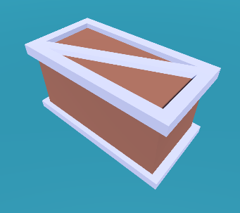

<h1 align="center">Boarded Sky</h1>

A unity game made in a summer inspired on Atari Breakout

	
	
	
  

# Current Phase:
**Version 1.0-alpha**

# Tutorial
Use the LEFT and RIGHT arrow keys or AD to move horizontally. 

Use the UP and DOWN keys to tilt the player paddle. 

Use the SPACEBAR key to enable the nitro.

The objective is to destroy as much bricks as you can with the less time possible. 

And don't forget to keep you alive... 

Tip: when you destroy all the bricks they reapear and you gain 1 extra life (up to 6 max).
Pro Tip: there's an **Interactive Tutorial** inside the game.

# How to play
Web version (WebGL): https://unity.encryptex.me

Binary Executable (.exe): https://github.com/EncryptEx/BoardedSky/releases/download/v.1.0-alpha/BoardedSky.1.0-alpha.Binary.Executable.zip

# Tools used
In this project I've used a lot of tools and programming languages:

Tools:
> Unity (Game Engine)

> Photopea (Images)

> Bosca Cecoil (Music)

> JetBrains Rider (Editor)

> Visual Studio 2019 (Alt Editor)

> VPS (Scoreboard)

Languages:
> C# (Game)

> PHP (Scoreboard Backend)

